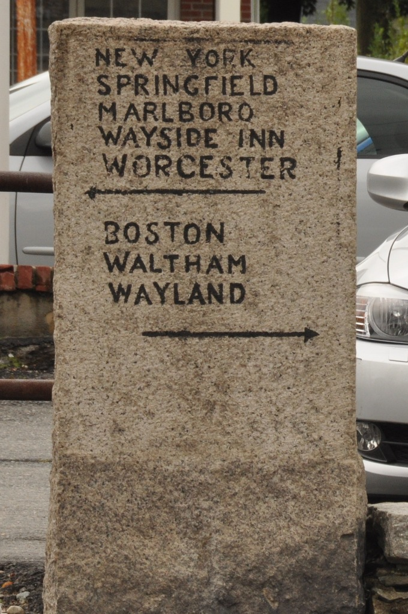

# Feature Complete, and other milestones
Today, after adding a share handler to the app, I decided that I'm "feature complete" for my 1.0! Why did I do that?

## Why milestones at all?
Decades ago, as a program manager at [Digidesign](https://en.wikipedia.org/wiki/Avid_Audio), I had the benefit of extensive on-the-job learning about project management for products including the ICON console-replacement control surface, PRE, and Command-8. Diving into complex electromechanical systems — amalgams of analog and digital hardware, firmware, application software, and multi-material/multi-process mechanical assemblies, mostly manufactured offshore — was truly overwhelming, as is this sentence. I'll be the first to admit that I stumbled through much of the job at first. Fortunately I was helped along by supportive co-workers like Andra Mitchell, Rob Campbell and the late Robin Parnaby, among many others who dared invest their time in my growth. In any case, it drilled into me the value of various program/project management principles and methods.

Of these, milestones are a favorite target of cynics, and understandably so. In their simplest presentation they appear to be a hard promise or commitment to have something done by a certain time. And they are often talked about that way, at least prior to their expiration, especially by "management". Outside of true "do or die" scenarios, however, among the weight-pulling members of the team they more often seem to represent a "plan of record". That sounds a lot weaker than a promise, and I suppose it is. But what we're really looking for here is a way to coordinate activity. Assuming people understand what kinds of things they are expected to have in place by a milestone, they can prioritize the activities accordingly, and, if need be, escalate issues that could impact that coordination. The latter should not necessarily be seen as a failure, but instead as an example of the milestone working as intended, since without the milestone the same issue might elicit nothing more than a shrug in the moment. Even in cases where the milestone appears to be blown due to complete inactivity by one or more would-be contributors, this is still valuable signal, possibly of an organizational or management problem. Conversely, engaging in heroics or deeply inefficient tactics just to "make the date" is often less than optimal. Communication is key, and the milestone should be seen as a communication instigator.

## Why milestones when it's just me?
Hey - great question! I just made a case that milestones are about communication and coordination, concepts that sound odd in the context of a team-of-one. Some reasons to use them anyway:
1. I'm used to having milestones, so why not.
2. "Great artists also ship," and while I don't claim to be a great artist, I'd like to ship.
3. To-do list items with due dates almost always take precedence over ones without.

## Why now?
I believe I've reached minimum viable product for the personas I've been channeling during development, which I might as well document here:
* a student involved in speech or debate club, who either wants to hold a lens up to a transcript of a prior debate to identify tactics.
* a skeptical consumer of news who is trying to assess the credibility of a source.
* a terminally-online person who falls prey to the forgivable but tragic compulsion to engage in comment-section arguments.
(I won't say which of these apply to me, though it's clearly not the first one.)

I strongly believe that the main theme of a 1.0 is "guessing what users want, even if they don't know it yet." With any luck, your guesses are educated enough to attract some actual users. And once you've gotten to that point, guessing takes a back seat to gathering feedback and learning how people actually perceive and employ this thing you've made. If that doesn't sound enticing, you could also tell yourself that since this thing is so useful, it's better to get it into users' hands now than make them wait. For an edgier take, you might remind yourself of the arrogance of continuing to think that your guessing is better than your users' actual experiencing. Hopefully one of these takes convinces you. Ship it.