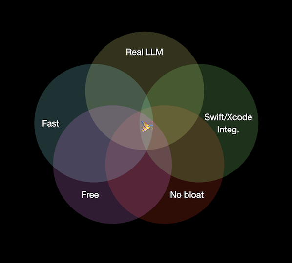

# Create ML: An Apple-y approach to ML
It's amazing and exciting that anyone with a computer can build and train an ML model. That said, it's reminiscent of using Core Audio a decade or two ago - quite a lot of overhead just to get to "Hello, world!", especially if you're somewhat new to the process. Enter Create ML, Apple's answer to machine learning for the masses… at least the masses with a basic understanding of machine learning.

## Foundation models are great...
As I've written elsewhere in this blog, my current main focus is an app for identifying logical fallacies in text passages, and learning what to do about them. The app is currently in [beta via TestFlight](https://testflight.apple.com/join/E7XdSWJW). Please join! I'm eager to get your feedback.

The heavy lifting is being done by Apple Foundation Models (AFM) which will ship for the first time in iOS 26 (still in beta at the time of this writing). AFM creates some amazing possibilities that were hitherto either impossible or impractical. What is the intersection of all these constraints, and did it even exist prior to AFM?

* "Real" LLM
* Fast enough for many purposes
* Runs on device (privacy, no network dependency)
* Tight integration with Swift/Xcode
* Doesn't bloat app footprint
* No licensing or subscription fee

So much to be excited about! I should note that "fast" is relative and subjective. For the purposes of my fallacy-detection app, fast means "fast enough", which in this case is ~1-2 seconds to when fallacy findings start streaming into the UI.

## ...but not the greatest for everything
It turns out that if you have a much narrower, ML-friendly task, inference can execute a few orders of magnitude faster with a good old ML model than with an LLM, while potentially also performing better in some or all sectors of the confusion matrix. A great example of such a task is the part of the fallacy-detection app that asks whether the text is analyzable at all. This gate is needed because AFM, in its eagerness to oblige, will steadfastly find fallacies in source code, random gibberish, math formulas, etc. _(Note to self: investigate fallacy detector for math formulas.)_ In my experience, extending the analysis prompt to consider this concern seems to only make it bad at identifying non-analyzable input AND bad at doing the analysis on suitable input. Yes, you can create a separate AFM prompt for the gate, however it will likely be slow and may not be very accurate even with few-shot inference.

Since this type of classification task is very much a "solved problem", it's ideally suited for the "on rails" workflow of Create ML. You just:

* Point it at your training data
* Choose some options from drop-down menus
* Press "go"
* Save the resulting model into your project

Yes, I'm eliding a lot of steps here, and you do kind of have to understand what's going on behind the scenes. But compare the above to the workflow of using other tools (PyTorch, TensorFlow) to generate a model, and you'll recognize that the elided steps fall out of the comparison because they exist no matter which approach you take (e.g. deciding your output classes, preprocessing data, etc.). Those tools also require a lot more setup and boilerplate to do even pretty straightforward stuff.

My point isn't to say that one is better than the other. Needless to say, the open-ended tools are far more powerful in terms of the possibilities they offer for custom model creation. But it is really convenient to have something like Create ML for cases where all that power isn't needed.

Even given the constraints that enable this simplicity, and the departure from AFM, we still have the following benefits:

* Real ML
* Often blazingly fast
* Runs on device
* Tight integration with Swift/Xcode
* Adds a few MBs to app footprint (certainly acceptable in the case of my fallacy app)
* No licensing or subscription fee

tl;dr: AFM is great. Core ML is also great, especially if your use case is addressed by Create ML

## Random findings
* ChatGPT is an excellent sidekick when putting together a pipeline for the generation, augmentation, and post-processing of training data
* BERT models don't seem to work in the Simulator, as they don't find their embeddings (they work great on device, though)
* Fun fact: the amount of time it took to _train_ the Max Entropy version of the classification model was comparable to the amount of time it took to run classification inference via AFM